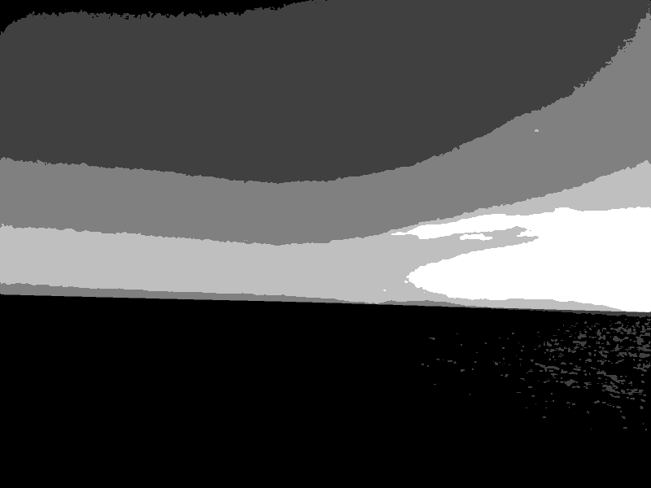
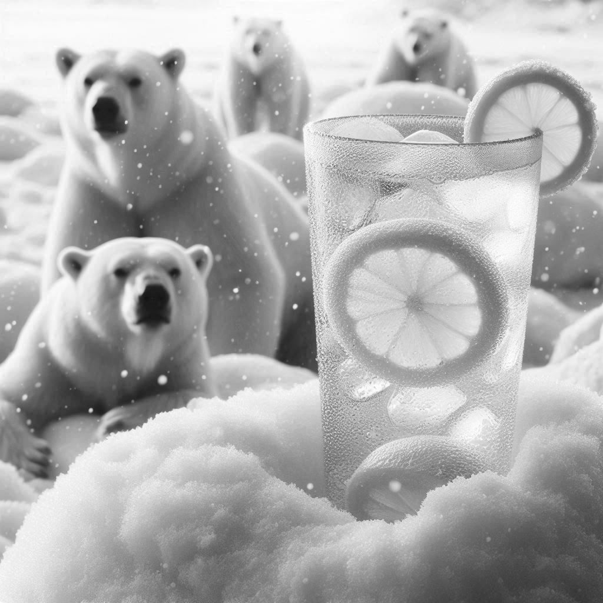

# Otsu Thresholding

Otsu's method is widely used in *Computer Vision* and *Image Processing*, where it used to perform automatic image thresholding. The goal of Otsu's method is to find the optimal thresholds that maximize the between-class variance, by exhaustively searches for the threshold that maximizes the between-class variance, defined as a weighted sum of variances of the two classes:


```matlab
$σ^2_b(t) = w_0w_1(m_0 - m_1)^2$
```


Where $w_0$ and $w_1$ are the weights of the background and foreground classes respectively, $m_0$ and $m_1$ are the means of the background and foreground pixel intensities.


The intuition behind maximizing the between-class variance ensures that the pixel intensities within each class are as compact as possible, while the two classes are as distinct as possible.


For multilevel thresholding, the method is applied recursively:

- The image is split at the best threshold, maximizing the between-class variance.

- The process continues for $N$ levels, recursively finding thresholds that separate the histogram into $N + 1$ regions.


### Steps of the algorithm

**Step1: Image Pre-processing**

- Convert the input image to grayscale.
  
  $img = rgb2gray(img);$
  
  

- Normalize the pixel values into the range $[0, 1]$.
  
  $img = double(img) / 255;$

---


**Step 2: Compute Histogram**

The histogram of the image is computed, which shows the distribution of pixel intensities.

$[counts, binEdges] = histcounts(img(:), 256);$

$binCenters = (binEdges(1:end-1) + binEdges(2:end)) / 2;$

---


**Step 3: Otsu's Method**

The goal is to maximize the between-class variance.

$thresholds = multilevelOtsu(counts, binCenters, N);$

---


**Step 4: Quantization**

Once we got the thresholds, the image is quantized into $N + 1$ distinct levels. The pixel values are replaced by the corresponding grayscale level based on the thresholds. For example, if pixel value falls between two thresholds, it is assigned to the next higher level.

$quantizedImage = zeros(size(img));$

$$levels = linspace(0, 1, N+1);$

$\text{for } i = 1:N$

        $quantizedImage(img > thresholds(i)) = levels(i + 1);$

$end$

$quantizedImage(img <= thresholds(1)) = levels(1);$

---


### Test Cases (N=4)

|  |  |
| ------------------------------------------------------------- | ------------------------------------------------------------- |
| $\text{Grayscale Image}$                                      | $\text{Quantized Image}$                                      |

|  |  |
| ------------------------------------------------------------------ | ----------------------------------------------------------------- |
| $\text{Grayscale Image}$                                           | $\text{Quantized Image}$                                          |

|  |  |
| ---------------------------------------------------------- | --------------------------------------------------------- |
| $\text{Grayscale Image}$                                   | $\text{Quantized Image}$                                  |


